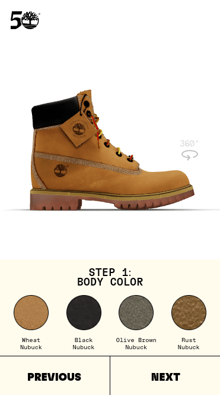
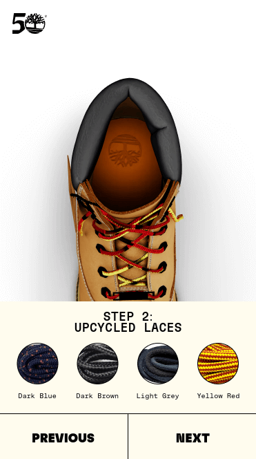

**Customize and preview Timberland boots in 3D**

## Information

Users are able to choose between several customization parameters and preview the 3D model of the boot with the configuration applied in real time.

<!-- ## Features -->

<!-- ## Instructions -->

## Technologies

The core technologies of _Timberland 3D Customizer_ are JavaScript and WebGL. The following libraries and tools are used:

| Name              | License | Description                                         |
| ----------------- | :-----: | --------------------------------------------------- |
| TypeScript        |   MIT   | A strongly typed language that builds on JavaScript |
| React             |   MIT   | Component-based, front-end interface library        |
| Three.js          |   MIT   | 3D graphics API for the web, based on WebGL         |
| React Three Fiber |   MIT   | A React renderer for Three.js                       |
| Drei              |   MIT   | Useful helpers for React Three Fiber                |
| Zustand           |   MIT   | State management                                    |
| Vite              |   MIT   | Frontend development tooling                        |

## Screenshots

## License

Copyright (c) 2023 Michael Kolesidis - All Rights Reserved.

THE CONTENTS OF THIS PROJECT ARE PROPRIETARY AND CONFIDENTIAL.
UNAUTHORIZED COPYING, TRANSFERRING OR REPRODUCTION OF THE CONTENTS OF THIS PROJECT, VIA ANY MEDIUM IS STRICTLY PROHIBITED.

The receipt or possession of the source code and/or any parts thereof does not convey or imply
any right to use them for any purpose other than the purpose for which they were provided to you.

The software is provided "AS IS", without warranty of any kind, express or implied, including but not limited to
the warranties of merchantability, fitness for a particular purpose and non infringement.
In no event shall the authors or copyright holders be liable for any claim, damages or other liability,
whether in an action of contract, tort or otherwise, arising from, out of or in connection with the software
or the use or other dealings in the software.

The above copyright notice and this permission notice shall be included in all copies or substantial portions of the Software.

🥾
